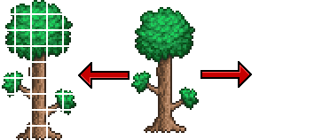

# TPadder

TPadder is a simple application that allows you to turn an item texture into an tile texture.

Terraria requires mutliblock tiles to have a 2 pixel padding between each block (a block is 16x16 pixels). Since doing this manually can become increasingly tedious for larger scale mods, I've made a simple application to take a non-padded texture and convert it into a padded tile texture. Additionally, it can also generate a highlight texture for any tile that interacts with the smart cursor in game.

### Example

### Prerequisites

Please note that the following prerequisites are specifically for running the Python version. If you only wish to run the application without Python, you can skip these requirements and directly use the executable file available on the [GitHub releases page](https://github.com/MdTanjeemHaider/TPadder/releases).

However, if you intend to run the Python version, please ensure that you have the following prerequisites in place:

* **Python:** Make sure you have Python installed on your system. you can download the latest version of python from the [official website](https://www.python.org/downloads/) and follow the installation instruction for your operating system.
* **Python Packages:** The **'tkinter'** package is usually included with the Python installations, but **'pillow'** may need to be installed seperately. You can install it by running the following command in your terminal or command prompt: `pip install pillow`
* **Pyinstaller:** This is only required if you wish to build the executable file. You can install it by running the following command in your terminal or command prompt: `pip install pyinstaller`

### Note

For optimal results, it is important to ensure that the source texture has dimensions that are multiples of 16px. Deviating from this guideline may result in unexpected results.

if your texture does not have the correct dimensions, follow these steps to adjust it:

1. Change the canvas size of your texture to match the correct dimensions by adding or removing pixels as necessary.
2. Center your texture within the adjusted canvas.

### Contribution

Contributions, forks, and feedback are all welcome! Feel free to contribute to TPadder's development, suggest improvements or report any issues on the GitHub repository.

### License

TPadder is released under the GNU General Public License v3, allowing you to freely use, modify, and distribute the mod in accordance with the terms outlined in the license.
